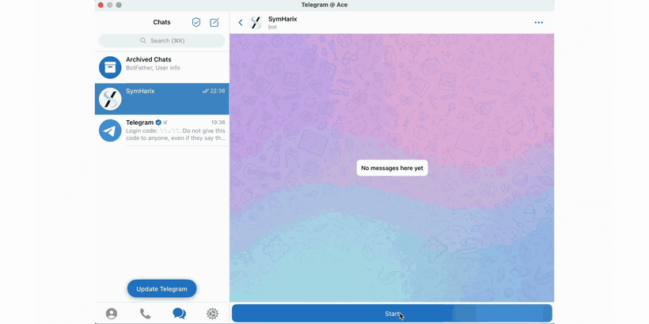
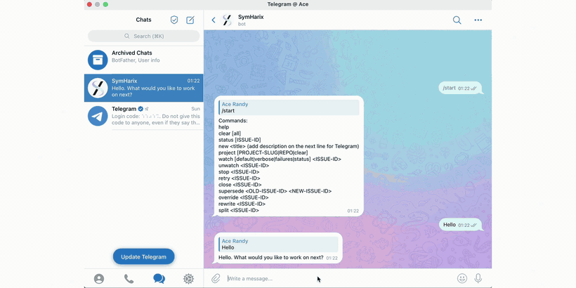

# ✨ SymHarix — Telegram-First AI Supervisor

<p align="center">
  
</p>

<p align="center">
  <a href="#quick-start"></a>
  <a href="#telegram-and-feishu-supervisor"></a>
  <a href="#core-flow"></a>
  <a href="./LICENSE"></a>
</p>

<p align="center">
  <strong>Language:</strong> English | <a href="./README.zh-CN.md">Chinese</a>
</p>

<p align="center">
  
</p>

<p align="center">
  <em>Conceptual flow illustration; actual Telegram, Runtime Deck, and Mini App screens may differ.</em>
</p>

## Demo Video

Watch the walkthrough: [SymHarix demo video](https://youtu.be/1dCix6hFUY0).

The video shows the full loop from Telegram intake to Plan Card approval, runtime progress, Mini App inspection, Harness review evidence, and a verified GitHub pull request.

## What SymHarix Is

SymHarix is a self-hostable control plane for supervised coding work. The user talks to a Telegram or Feishu bot, the Supervisor clarifies or prepares a Plan Card, and approved work is routed to the configured GitHub repository through the bundled Claude-compatible runtime.

Telegram is the default local entrypoint, while Feishu can run as an independent long-connection entrypoint for teams that cannot conveniently use Telegram. Runtime Deck is the diagnostics and control surface. Linear and GitHub remain the durable records for work items, branches, PRs, review evidence, and delivery state.

## Guided Tour

SymHarix is intentionally beginner-friendly: it guides users from a Telegram or Feishu request into a tracked issue, keeps overall progress visible in preview cards, and lets the operator ask about status or blockers at any time.

<p align="center">
  
</p>

When an issue is too large, SymHarix helps split it into focused child issues. After the user confirms the split, it runs the child issues by priority until the project is complete.

<p align="center">
  
</p>

For deeper visibility, the Mini App shows the live Status Overview, code diffs, stage details, and real-time token usage for the current issue.

<p align="center">
  
</p>

The SymHarix reviewer checks code from the dev agent before delivery can continue. The branch detail view makes review status and reviewer evidence visible before merge.

<p align="center">
  
</p>

## Quick Start

```bash
bun run setup
# edit .env and WORKFLOW.md
bun run start
```

`bun run start` is an alias for the Telegram surface. To run only Feishu, use:

```bash
bun run start:feishu
```

Open Runtime Deck:

```text
http://localhost:3000/runtime
```

Use another port only when needed:

```bash
PORT=4000 bun run start
```

Stop local services:

```bash
bun run stop
```

Check the bundled runtime:

```bash
bash scripts/check-runtime.sh
```

On a Linux server, install a systemd service so SymHarix keeps running after SSH disconnects:

```bash
bash scripts/install-systemd-service.sh
sudo journalctl -u symharix -f
```

## Core Flow

```text
Telegram or Feishu / Runtime Deck / Linear issue
  -> Supervisor session, repo routing, Plan Card, approval
  -> Issue-scoped run in Runtime history
  -> Workspace checkout + feature branch
  -> AgentRunner -> scripts/claude-adapter.cjs
  -> bundled Claude-compatible runtime
  -> Code changes + tests + evidence
  -> GitHub branch -> pull request -> review
  -> Merge or delivery blocker
  -> Linear state + Runtime Deck + Mini App updated
```

The main behavior:

- Telegram or Feishu handles conversation, clarification, repo switching, Plan Cards, approval, and concise lifecycle updates.
- Runtime Deck shows issue state, timelines, token usage, recent agent progress, delivery blockers, and safe write actions.
- Mini App issue views expose active stage, active PR context, replay history, and file diffs when a workspace or PR head is available.
- Approved work becomes an issue-scoped coding run: SymHarix prepares the workspace, creates or tracks a feature branch, captures verification evidence, opens or follows a GitHub PR, and keeps review and merge state visible.
- Repository routing is explicit and fail-closed. A Linear `project_slug` must map to a GitHub repository in `WORKFLOW.md`.
- Agent execution runs through `scripts/claude-adapter.cjs`, which launches the bundled Claude-compatible runtime. Read-only repo understanding uses the same adapter unless overridden.

## Configuration

SymHarix reads three layers:

1. `.env`: secrets, API keys, chat-surface, Runtime Deck, and LLM settings.
2. `WORKFLOW.md`: tracker states, repository routing, agent command, verification scenarios.
3. Target repo contracts: `.symphony-repo.yaml` and `.symphony-constitution.md`.

Use `SYMHARIX_*` for new environment variables. Legacy `SYMPHONY_*` variables, `.symphony-*` contracts, and the local `symphony.db` file remain supported for compatibility.

Minimum local `.env`:

```dotenv
SYMHARIX_TRACKER_KIND=linear
SYMHARIX_TRACKER_API_KEY=...
SYMHARIX_TRACKER_PROJECT_SLUG=sample-project
GITHUB_TOKEN=...
ANTHROPIC_API_KEY=...
```

Choose at least one chat surface:

- Telegram: configure the Telegram variables and run `bun run start:telegram` or `bun run start`.
- Feishu: configure the Feishu variables and run `bun run start:feishu`.
- Both can exist in `.env`, but each local start command isolates its own surface. `start:feishu` does not require Telegram variables, and `start:telegram` does not require Feishu variables.

Minimum Telegram `.env`:

```dotenv
SYMHARIX_TELEGRAM_BOT_TOKEN=...
SYMHARIX_TELEGRAM_WEBHOOK_SECRET=...
SYMHARIX_TELEGRAM_OPERATOR_IDS=123456789
```

Minimum Feishu `.env`:

```dotenv
SYMHARIX_FEISHU_APP_ID=cli_xxx
SYMHARIX_FEISHU_APP_SECRET=...
SYMHARIX_FEISHU_OPERATOR_IDS=ou_xxx
```

Required Feishu app permissions for the full SymHarix bot flow:

| Scope | Purpose |
| --- | --- |
| `im:message.group_at_msg.include_bot:readonly` | Receive group messages that mention the current bot and include other bots/users. |
| `im:message.group_at_msg:readonly` | Receive group messages where users mention the bot. |
| `im:message.p2p_msg:readonly` | Receive direct messages sent to the bot. |
| `im:message:send_as_bot` | Reply as the bot. |
| `im:message:update` | Edit sent messages/cards for Plan Card and runtime-card updates. |
| `im:resource` | Upload and display card image/file resources. |

Run Feishu locally with long connection mode:

```bash
bun run start:feishu
```

Feishu long connection message intake does not require a public IP or webhook URL. If mobile Feishu clients need to open the runtime view, use a stable public ingress with `SYMHARIX_PUBLIC_BASE_URL=https://your-domain.example`, or set `SYMHARIX_FEISHU_RUNTIME_OPEN_MODE=applink_web_url` during local development so `start:feishu` creates a temporary `trycloudflare.com` tunnel only for Mini App/runtime links. Telegram webhook and Mini App features still require a stable publicly reachable HTTPS URL in production. Use a domain with HTTPS reverse proxy or a named Cloudflare Tunnel; quick `trycloudflare.com` tunnels are intended for local development and demos, not 24/7 production.

Example repository route:

```yaml
repositories:
  routing:
    sample-project:
      github_owner: acme
      github_repo: demo-app
```

The route key must match the Linear `project_slug`. Missing routes block dispatch before workspace creation.

## Telegram And Feishu Supervisor

Telegram and Feishu now share the same Supervisor logic. Feishu uses Open Platform long connection mode; after enabling bot capability, set both Events and Callbacks to persistent connection and add `im.message.receive_v1` plus `card.action.trigger` to mirror the Telegram conversation, Plan Card, approval buttons, runtime cards, and follow-ups.

The two transports are intentionally isolated. Feishu-origin issues send follow-ups to the Feishu origin conversation and Feishu operations chat only; Telegram-origin issues do the same on Telegram. This keeps Feishu usable even when Telegram is unconfigured or unreachable.

A typical Telegram/Feishu interaction:

1. The user sends a natural-language request.
2. Supervisor answers, asks a follow-up, switches repo context, reads a routed repo, or shows a Plan Card.
3. Risky or broad writes wait for approval.
4. Approved work is materialized and executed through the Orchestrator.
5. Telegram/Feishu edits the active lifecycle card instead of sending duplicate updates.

Low-risk control actions such as listing repositories, showing cards, watching issues, stopping, retrying, or setting the default project go through Supervisor tools. Higher-risk actions such as create, close, supersede, split, rewrite, or override are governed by the confirmation policy.

## Health And Verification

```bash
bun run health
```

Useful local endpoints:

```text
http://localhost:3000/api/v1/runtime/manifest
http://localhost:3000/api/v1/bots/manifest
http://localhost:3000/api/v1/runtime/overview
```

For Telegram, trust `/api/v1/bots/manifest`: check `health`, `webhook_url`, `public_base_url`, `mini_app_base_url`, pending updates, and the last webhook error.

For delivery, trust Runtime issue detail. For example, `delivery_code=merge_blocked` means review proof passed, but the final merge or delivery action still needs attention.

Live Telegram-first verification:

```bash
bun --env-file=.env run src/cli/index.ts verify-live-supervisor \
  --project-slug sample-project \
  --server-url http://localhost:3000 \
  --telegram-chat-id <chat-id> \
  --matrix
```

Local development checks:

```bash
bun run test
bun run build
git diff --check
```

## Documentation

- [QUICKSTART.md](./QUICKSTART.md): local setup and first Telegram test.
- [docs/CONFIGURATION.md](./docs/CONFIGURATION.md): `.env`, `WORKFLOW.md`, and target-repo contract reference.
- [docs/AI_OPERATOR_GUIDE.md](./docs/AI_OPERATOR_GUIDE.md): live-debugging rules for maintainers and AI agents.
