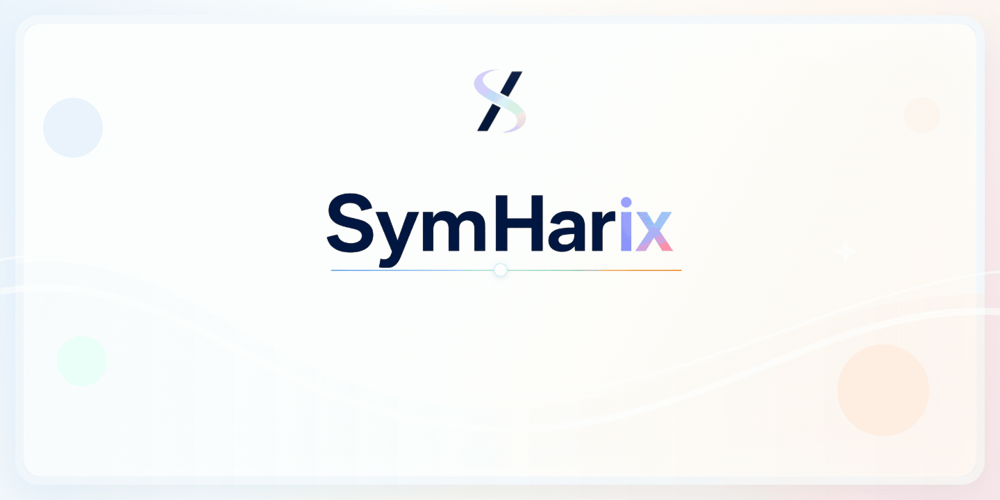
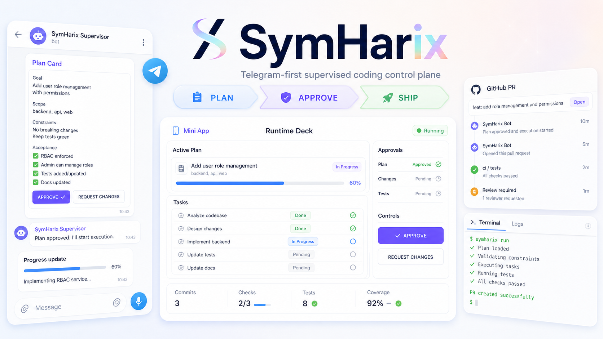

# ✨ SymHarix — Telegram-First AI Supervisor

<p align="center">
  
</p>

<p align="center">
  <a href="#快速开始"></a>
  <a href="#telegram-supervisor"></a>
  <a href="#核心链路"></a>
  <a href="./LICENSE"></a>
</p>

<p align="center">
  <strong>语言：</strong> <a href="./README.md">English</a> | 中文
</p>

<p align="center">
  
</p>

<p align="center">
  <em>Conceptual flow illustration; actual Telegram, Runtime Deck, and Mini App screens may differ.</em>
</p>

## 演示视频

查看完整演示：[SymHarix demo video](https://youtu.be/1dCix6hFUY0)。

视频展示从 Telegram 需求输入到 Plan Card 审批、运行进展、Mini App 查看、Harness review 证据，以及最终 verified GitHub pull request 的完整闭环。

可自托管、Telegram 优先的 coding agent 监督控制平面。

## SymHarix 是什么

SymHarix 是一个可部署在本机或服务器上的代码执行控制平面。用户通过 Telegram Bot 提需求，Supervisor 负责澄清、推荐计划或展示 Plan Card；用户批准后，任务会按配置路由到 GitHub 仓库，并通过内置 Claude-compatible runtime 执行。

Telegram 是主要用户交互闭环。Runtime Deck 是诊断和控制界面。Linear 与 GitHub 负责保存任务、分支、PR、review 证据和交付状态。

## 快速开始

```bash
bun run setup
# 编辑 .env 和 WORKFLOW.md
bun run start
```

打开 Runtime Deck：

```text
http://localhost:3000/runtime
```

只有端口冲突时才换端口：

```bash
PORT=4000 bun run start
```

停止本地服务：

```bash
bun run stop
```

检查内置 runtime：

```bash
bash scripts/check-runtime.sh
```

在 Linux 服务器上，安装 systemd service 后 SSH 断开也会继续运行：

```bash
bash scripts/install-systemd-service.sh
sudo journalctl -u symharix -f
```

## 核心链路

```text
Telegram / Runtime Deck / Linear issue
  -> Supervisor session, repo routing, Plan Card, approval
  -> Issue-scoped run in Runtime history
  -> Workspace checkout + feature branch
  -> AgentRunner -> scripts/claude-adapter.cjs
  -> bundled Claude-compatible runtime
  -> Code changes + tests + evidence
  -> GitHub branch -> pull request -> review
  -> Merge or delivery blocker
  -> Linear state + Runtime Deck + Mini App updated
```

主要行为：

- Telegram 负责对话、澄清、切换仓库、Plan Card、审批和简洁的生命周期更新。
- Runtime Deck 展示 issue 状态、时间线、token 使用量、近期 agent 进展、交付阻塞和安全写操作。
- Mini App issue 页面会展示当前阶段、active PR、回放历史，并在 workspace 或 PR head 可用时展示文件 diff。
- 用户批准后，任务会变成一个 issue-scoped coding run：SymHarix 准备 workspace、创建或跟踪 feature branch、保存验证证据、创建或跟踪 GitHub PR，并持续展示 review 与 merge 状态。
- 仓库路由必须显式配置，并且缺失时 fail closed。Linear `project_slug` 必须映射到 `WORKFLOW.md` 中的 GitHub 仓库。
- Agent 执行链路通过 `scripts/claude-adapter.cjs` 运行，并由它启动内置 Claude-compatible runtime；只读仓库理解默认也使用这个 adapter，除非显式覆盖。

## 配置

SymHarix 读取三层配置：

1. `.env`：密钥、API key、Telegram、Runtime Deck 和 LLM 配置。
2. `WORKFLOW.md`：tracker 状态、仓库路由、agent 命令和验证场景。
3. 目标仓库契约：`.symphony-repo.yaml` 与 `.symphony-constitution.md`。

新的环境变量使用 `SYMHARIX_*`。旧的 `SYMPHONY_*` 变量、`.symphony-*` 契约和本地 `symphony.db` 文件仍作为兼容层保留。

本地运行最小 `.env`：

```dotenv
SYMHARIX_TRACKER_KIND=linear
SYMHARIX_TRACKER_API_KEY=...
SYMHARIX_TRACKER_PROJECT_SLUG=sample-project
GITHUB_TOKEN=...
ANTHROPIC_API_KEY=...
```

Telegram 最小 `.env`：

```dotenv
SYMHARIX_TELEGRAM_BOT_TOKEN=...
SYMHARIX_TELEGRAM_WEBHOOK_SECRET=...
SYMHARIX_TELEGRAM_OPERATOR_IDS=123456789
```

SymHarix 不要求公网 IP，但 Telegram webhook 和 Mini App 功能需要一个稳定、可公网访问的 HTTPS URL。生产环境建议使用域名 + HTTPS 反向代理，或 named Cloudflare Tunnel。快速的 `trycloudflare.com` 隧道适合本地开发和 demo，不适合作为 24/7 生产入口。

仓库路由示例：

```yaml
repositories:
  routing:
    sample-project:
      github_owner: acme
      github_repo: demo-app
```

路由 key 必须匹配 Linear `project_slug`。缺失路由会在创建 workspace 前阻止 dispatch。

## Telegram Supervisor

典型 Telegram 交互：

1. 用户发送自然语言需求。
2. Supervisor 直接回答、追问细节、切换仓库上下文、读取已路由仓库，或展示 Plan Card。
3. 高风险或范围较大的写操作等待审批。
4. 用户批准后，任务被物化并交给 Orchestrator 执行。
5. Telegram 编辑当前生命周期卡片，而不是发送重复消息。

低风险控制动作，例如列出仓库、展示卡片、watch issue、stop、retry、设置默认项目，会走 Supervisor 工具。create、close、supersede、split、rewrite、override 等高风险动作受确认策略约束。

## 健康检查与验证

```bash
bun run health
```

常用本地端点：

```text
http://localhost:3000/api/v1/runtime/manifest
http://localhost:3000/api/v1/bots/manifest
http://localhost:3000/api/v1/runtime/overview
```

验证 Telegram 时以 `/api/v1/bots/manifest` 为准：检查 `health`、`webhook_url`、`public_base_url`、`mini_app_base_url`、pending updates 和最后一次 webhook 错误。

验证交付时以 Runtime issue detail 为准。例如 `delivery_code=merge_blocked` 表示 review 证据已通过，但最终 merge 或交付动作仍需要处理。

Telegram-first 实时验证：

```bash
bun --env-file=.env run src/cli/index.ts verify-live-supervisor \
  --project-slug sample-project \
  --server-url http://localhost:3000 \
  --telegram-chat-id <chat-id> \
  --matrix
```

本地开发检查：

```bash
bun run test
bun run build
git diff --check
```

## 文档

- [QUICKSTART.zh-CN.md](./QUICKSTART.zh-CN.md)：本地配置和第一次 Telegram 测试。
- [docs/CONFIGURATION.zh-CN.md](./docs/CONFIGURATION.zh-CN.md)：`.env`、`WORKFLOW.md` 与目标仓库契约参考。
- [docs/AI_OPERATOR_GUIDE.zh-CN.md](./docs/AI_OPERATOR_GUIDE.zh-CN.md)：维护者与 AI agent 的实时排障规则。
