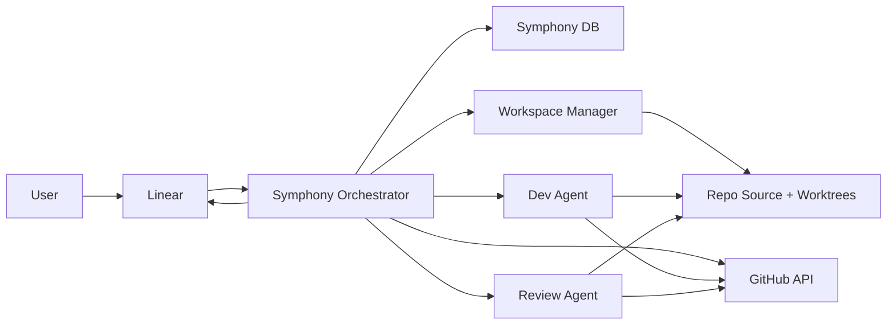

# Symphony + Claude Code 云端 E2E 设计稿

**日期**: 2026-04-20
**状态**: Draft
**目标**: 设计一个以 Symphony 为控制面、Claude Code 为执行面、Linear 为需求入口、GitHub 为工程事实源的云端研发系统，让用户主要通过提需求推动开发。

## 1. 设计目标

本设计解决以下核心问题：

1. 一个仓库同时存在多个 issue 时，避免为每个 issue 重复 clone 整个仓库。
2. 将任务调度、工作区管理、Agent 执行、PR 审阅、状态同步分层，避免职责混乱。
3. 让 Dev Agent 和 Review Agent 的上下文来源稳定、可审计、可恢复。
4. 保证只有 merge 成功后才将 issue 标记为 `Done`。
5. 支持返工、冲突修复、最大尝试次数、用户取消、工作区清理等完整 E2E 流程。
6. 为后续云端部署和多仓库扩展保留清晰边界。

## 2. 核心设计原则

### 2.1 三类真相源

- `Linear` 是需求入口和用户可见流程状态源。
- `GitHub` 是工程事实源。
  这里包含 GitHub Issue、PR、review threads、merge 状态、checks 状态。
- `Symphony DB` 是运行时控制面真相源。
  这里记录映射、锁、attempt、workspace、agent run、审计日志、同步事件。

### 2.2 Agent 不是调度器

- `Orchestrator` 负责发现 issue、判断可否开发、分配执行、重试、取消、同步状态。
- `Dev Agent` 不主动轮询 Linear，不直接决定下一阶段。
- `Review Agent` 不直接决定全局调度，只返回结构化审阅结论。

### 2.3 GitHub 中信息分层

- `PR` 保存原始审阅事实：
  review comments、inline comments、checks、mergeability、latest diff。
- `GitHub Issue` 保存长期任务摘要：
  需求背景、关键约束、阶段总结、最近一轮 review 摘要、指向 PR 的链接。

结论：不要把 PR 的所有原始审阅内容完整搬运到 GitHub Issue 再作为唯一真相源；应保留 PR 为原始事实源，GitHub Issue 只持有结构化摘要。

### 2.4 Workspace 复用而不是 repo 重复 clone

- 一个仓库只保留一个共享 `source` 副本。
- 每个 issue 拥有一个独立 `worktree`。
- 返工复用同一个 `worktree`。
- merge 成功或取消后清理对应 `worktree`，保留 repo cache。

## 3. 目标系统结构



## 4. 职责划分

### 4.1 Orchestrator

负责：

- 轮询或订阅 Linear / GitHub 事件
- 发现可开发 issue
- 建立 `Linear issue -> GitHub issue -> PR -> workspace` 映射
- 创建或复用 worktree
- 调度 Dev / Review Agent
- 根据结构化结果推进阶段
- 执行重试、返工、取消、清理
- 将关键状态同步回 Linear

不负责：

- 直接编写代码
- 直接做 review 结论判断
- 将 GitHub 原始事件长期存储为业务逻辑输入

### 4.2 Dev Agent

负责：

- 读取 GitHub Issue 摘要、PR 上下文、未解决 review 建议、本地代码
- 修改代码、运行测试、提交 commit、push branch
- 创建或更新 PR
- 生成本轮开发摘要和 handover

不负责：

- 自己拉取 Linear 选任务
- 自己切换 issue 到 `In Review`
- 自己决定 merge

### 4.3 Review Agent

负责：

- 读取 PR diff、checks、review threads、GitHub Issue 摘要
- 给出结构化决策：
  `APPROVE` / `REQUEST_CHANGES` / `MERGE_BLOCKED`
- 在 PR 中留下审阅结论
- 生成一份给 Dev Agent 的结构化返工摘要

不负责：

- 自己修改代码
- 自己维护全局 attempt 计数
- 自己直接控制下一次调度

### 4.4 Workspace Manager

负责：

- 维护仓库 cache
- 维护 issue worktree
- 清理已完成或已取消 issue 的工作区
- 保证路径安全、分支隔离和 worktree 可恢复

## 5. Workspace / Worktree 架构

### 5.1 目录布局

推荐目录：

```text
/workspace/
  <repo>/
    source/
    worktrees/
      <linear-key>/
    meta/
      repo-state.json
```

说明：

- `source/` 是仓库主缓存，只做 fetch、reset、main 同步。
- `worktrees/<linear-key>/` 是 issue 专属工作区。
- `meta/` 记录本地 repo cache 元信息，可选。

### 5.2 行为规则

- 第一次处理某 repo 时，初始化 `source/`。
- 每个 issue 分支固定为 `feature/<linear-key>`。
- 同一个 issue 的返工始终复用同一个 worktree。
- 清理 issue 时，只删除 `worktrees/<linear-key>`，不删除 `source/`。
- `source/` 上禁止 agent 直接开发。

### 5.3 与当前代码的关系

当前 [src/workspace/manager.ts](/Users/example/projects/symharix/src/workspace/manager.ts) 已经有 git worktree 能力，但仍混杂了 repo clone、branch 删除、path fallback 等逻辑。后续应重构为两层：

- `RepoCacheManager`
  负责 `source/` 的 clone、fetch、reset、default branch 同步
- `IssueWorktreeManager`
  负责创建、复用、修复、删除 issue worktree

## 6. 业务对象和映射关系

### 6.1 主业务对象

- `Linear Issue`
- `GitHub Issue`
- `GitHub Pull Request`
- `Workspace / Worktree`
- `Agent Run`

### 6.2 核心映射

系统必须显式维护以下映射，而不是隐式推导：

```text
Linear Issue 1 --- 1 GitHub Issue
Linear Issue 1 --- 0..1 Active PR
Linear Issue 1 --- 1 Workspace
Linear Issue 1 --- N Agent Runs
Linear Issue 1 --- N Review Rounds
```

### 6.3 映射规则

- GitHub Issue 只在 Linear Issue 首次进入系统时创建一次。
- 同一个 Linear Issue 只允许同时存在一个 active PR。
- 同一个 Linear Issue 只允许同时存在一个 active worktree。
- Dev 返工时更新原 PR，而不是创建新 PR。
- Review round 递增，但 PR 不变。

## 7. 数据模型设计

### 7.1 建议新增或重构的主表

当前 [src/database/schema.ts](/Users/example/projects/symharix/src/database/schema.ts) 里的 `tasks / workspaces / issue_tracking / review_history / audit_log` 还不够承载完整控制面。建议引入以下主表。

#### `work_items`

字段建议：

- `id`
- `linear_issue_id`
- `linear_identifier`
- `linear_state`
- `github_repo`
- `github_issue_number`
- `active_pr_number`
- `branch_name`
- `workspace_path`
- `orchestrator_state`
- `dev_attempt_count`
- `review_round`
- `last_review_decision`
- `cancelled_at`
- `merged_at`
- `created_at`
- `updated_at`

用途：

- 成为系统对单个 work item 的主视图
- 支撑调度、恢复、展示、清理

#### `agent_runs`

字段建议：

- `id`
- `work_item_id`
- `agent_type` (`dev` / `review`)
- `run_status`
- `input_summary`
- `output_summary`
- `decision`
- `error`
- `started_at`
- `finished_at`

用途：

- 审计每次 agent 执行
- 支持恢复和问题排查

#### `review_events`

字段建议：

- `id`
- `work_item_id`
- `pr_number`
- `review_round`
- `decision`
- `summary_md`
- `requested_changes_md`
- `merge_block_reason`
- `created_at`

用途：

- 将 review 的结构化输出保存为系统事实

#### `sync_events`

字段建议：

- `id`
- `work_item_id`
- `target_system` (`linear` / `github`)
- `action`
- `payload_json`
- `result`
- `error`
- `created_at`

用途：

- 支撑补偿重试
- 支撑可观测性

### 7.2 现有表去向

- `issue_tracking` 可迁移到 `work_items`，不再单独保留为主表。
- `review_history` 可演化为 `review_events`。
- `audit_log` 可保留，但更适合作为低层运行日志，而不是业务主记录。

## 8. 状态机设计

### 8.1 业务状态

以用户和工程流程为视角，业务状态建议固定为：

- `Todo`
- `In Progress`
- `In Review`
- `Done`
- `Cancelled`

规则：

- 只有 PR merge 成功后才能进入 `Done`
- 用户取消是最高优先级，任何阶段都可转入 `Cancelled`

### 8.2 Orchestrator 内部状态

与 Linear 业务状态分离，内部状态建议使用：

- `discovering`
- `mapping`
- `workspace_ready`
- `dev_running`
- `dev_post_processing`
- `review_running`
- `review_post_processing`
- `needs_rework`
- `retry_scheduled`
- `halted`
- `completed`
- `cancelled`
- `failed`

### 8.3 关键转移规则

#### 开发主链

`Todo / In Progress`
-> issue 可派发
-> 确保 GitHub Issue 存在
-> worktree 准备完成
-> Dev Agent 执行
-> PR create/update 成功
-> Linear 更新为 `In Review`

#### 审阅通过链

`In Review`
-> Review Agent 返回 `APPROVE`
-> merge 检查通过
-> 执行 merge
-> merge 成功
-> Linear 更新为 `Done`
-> 清理 worktree

#### 审阅打回链

`In Review`
-> Review Agent 返回 `REQUEST_CHANGES`
-> PR 中写入 review
-> GitHub Issue 更新摘要
-> Linear 更新为 `In Progress`
-> worktree 保留
-> Dev Agent 继续返工

#### 合并阻塞链

`In Review`
-> Review Agent 返回 `MERGE_BLOCKED`
-> 原因可能是冲突、checks 失败、分支落后
-> 生成返工任务
-> Linear 更新为 `In Progress`
-> Dev Agent 修复后重新更新 PR

#### 取消链

任意非终态
-> 用户将 Linear 设为 `Cancelled`
-> Orchestrator 终止运行
-> 清理 retry、session、worktree
-> 不再继续处理该 issue

## 9. E2E 流程设计

### 9.1 创建和映射

1. 用户在 Linear 创建 issue。
2. Orchestrator 发现 issue 且判断可开发。
3. 根据 `project/repo` 路由找到对应 GitHub repo。
4. 如果还没有 GitHub Issue，则创建一个。
5. 在 `work_items` 中记录映射。

### 9.2 开发阶段

1. Orchestrator 确保 repo `source` 已同步最新主分支。
2. 创建或复用该 issue 的 worktree。
3. Dev Agent 获取上下文并开发。
4. Dev Agent push 分支。
5. Dev Agent 创建或更新 PR。
6. Orchestrator 验证 PR 已存在并更新映射。
7. Orchestrator 将 Linear 状态设为 `In Review`。

### 9.3 审阅阶段

1. Review Agent 读取 PR、checks、review threads、GitHub Issue 摘要。
2. 输出结构化决策。
3. 若 `APPROVE` 且可 merge，则执行 merge。
4. 只有 merge 成功后，Orchestrator 才把 Linear 更新为 `Done`。

### 9.4 打回与返工

1. 如果 Review Agent 返回 `REQUEST_CHANGES`，则将结构化意见写入 PR review。
2. 同时把 review 摘要同步进 GitHub Issue。
3. Linear 状态改回 `In Progress`。
4. 返工复用原 worktree 和原 PR。
5. `dev_attempt_count += 1`。

### 9.5 最大尝试次数

- 默认最多 3 次开发尝试。
- 超过上限后，work item 进入 `failed`。
- 不自动继续执行，等待人工处理或用户重新开放。

### 9.6 完成与清理

1. merge 成功后，记录 `merged_at`。
2. Linear 更新为 `Done`。
3. 清理 issue worktree。
4. 在 `source/` 上执行最新主分支同步。
5. 清理该 issue 的本地临时痕迹。

## 10. Dev Agent / Review Agent 信息流

### 10.1 Dev Agent 输入契约

Dev Agent 只读以下来源：

- GitHub Issue 标题与正文
- GitHub Issue 中的结构化任务摘要
- 当前 active PR
- PR 未解决 review comments
- 上一轮 review 摘要
- 本地 worktree 代码
- 本轮执行前由 Symphony 注入的系统上下文

Dev Agent 不读：

- Linear 原始状态细节
- 调度内部锁和 retry 信息

### 10.2 Dev Agent 输出契约

Dev Agent 输出：

- commit / push
- PR create/update
- 变更摘要
- 测试结果
- handover

### 10.3 Review Agent 输入契约

Review Agent 只读：

- PR diff
- PR review threads
- CI/check 状态
- mergeability 状态
- GitHub Issue 摘要
- 上一轮 dev summary

### 10.4 Review Agent 输出契约

Review Agent 必须输出结构化 JSON：

```json
{
  "decision": "APPROVE | REQUEST_CHANGES | MERGE_BLOCKED",
  "summary": "string",
  "requested_changes": "string | null",
  "merge_block_reason": "string | null",
  "next_action": "merge | retry_dev | wait"
}
```

## 11. 同步策略

### 11.1 Linear 同步规则

同步到 Linear 的内容只保留用户可见流程信息：

- `Todo -> In Progress`
- `In Progress -> In Review`
- `In Review -> In Progress`
- `In Review -> Done`
- `* -> Cancelled`

还可以同步摘要 comment，但不要求把 GitHub 原始讨论完整复制进去。

### 11.2 GitHub 同步规则

同步到 GitHub 的内容应完整体现工程上下文：

- 首次从 Linear 创建 GitHub Issue
- PR 链接写回 GitHub Issue
- 每轮 review 的结构化摘要写回 GitHub Issue
- 原始 review 保持在 PR

### 11.3 结论

- `GitHub` 承载工程上下文
- `Linear` 承载业务状态
- `Symphony DB` 承载调度和恢复事实

## 12. 取消、冲突、失败恢复

### 12.1 用户取消

用户在 Linear 标记 `Cancelled` 后：

- 立即中断该 issue 的调度优先级最高
- 停止运行中的 session
- 取消 retry
- 清理 worktree
- 保留审计记录

### 12.2 Merge 冲突

如果 merge 前发现冲突：

- Review Agent 返回 `MERGE_BLOCKED`
- Linear 回到 `In Progress`
- Dev Agent 处理冲突并更新原 PR

### 12.3 Session 崩溃

如果 Dev/Review Agent 进程崩溃：

- `agent_runs` 记录失败
- `orchestrator_state` 标记为 `retry_scheduled`
- worktree 不清理
- 下次从同一 worktree 恢复

## 13. 云端部署方案

### 13.1 控制面与执行面分离

推荐部署结构：

- `API / Intake Service`
  接收用户请求、创建或更新 Linear issue
- `Orchestrator Service`
  处理调度、映射、同步、状态机
- `Worker Pool`
  承载 Dev / Review Agent 运行
- `Repo Cache Volume`
  存放 `source/` 和 `worktrees/`
- `Postgres`
  存放控制面状态
- `Redis / Queue`
  存放任务队列与事件

### 13.2 V1 与 V2

#### V1

- 以轮询为主
- 单实例 orchestrator
- 单机 repo cache
- SQLite 可先用作本地开发环境

#### V2

- 引入 Linear Webhook
- 引入 GitHub Webhook
- 用 Postgres 取代 SQLite
- 用 Redis / queue 支撑多 worker
- 用 GitHub App 取代个人 token

## 14. 对当前仓库的落地建议

### 14.1 先保留的部分

- [src/orchestrator/index.ts](/Users/example/projects/symharix/src/orchestrator/index.ts) 的控制面主循环
- [src/workspace/manager.ts](/Users/example/projects/symharix/src/workspace/manager.ts) 的 worktree 基础能力
- [scripts/lib/github_client.py](/Users/example/projects/symharix/scripts/lib/github_client.py) 的 PR/review 操作能力

### 14.2 需要重构的部分

- 让 `Orchestrator` 而不是 Dev Agent 负责 issue 发现和派发
- 明确 `GitHub Issue` 与 `PR` 的双层语义
- 增加 `work_items` 主表和 `agent_runs / review_events / sync_events`
- 将当前零散的 state store 逐步收敛到控制面模型
- 让 `workspace manager` 按 `repo source + issue worktrees` 模式重构

### 14.3 prompt / context 方向

- Dev prompt 只注入 GitHub 工程上下文和当前 worktree 状态
- Review prompt 只注入 PR 审阅上下文和结构化输出格式
- Linear 不直接进入 Dev Agent 的工作上下文，只作为 orchestrator 的调度输入

## 15. 成功标准

一个满足目标的 Symphony 系统，应该达到以下标准：

1. 一个 repo 同时跑多个 issue 时，只保留一个 repo cache。
2. 同一个 issue 在返工周期内始终复用同一 worktree 和同一 PR。
3. merge 成功是进入 `Done` 的唯一入口。
4. 用户取消可立即停止所有后续处理。
5. Dev / Review Agent 的输入输出来源稳定、可审计、可恢复。
6. 用户主要面对需求与状态，不需要参与工程细节协调。

## 16. 最终结论

理想的 Symphony + Claude Code 云端系统，不是“让 Agent 自己自由协作”，而是：

- 用 `Linear` 承载需求入口和用户可见状态
- 用 `GitHub` 承载工程事实和协作痕迹
- 用 `Symphony` 承载调度、恢复、清理和治理

简化成一句话就是：

**让用户只提需求，让 Symphony 负责把需求安全、可审计地推进到 merge。**
