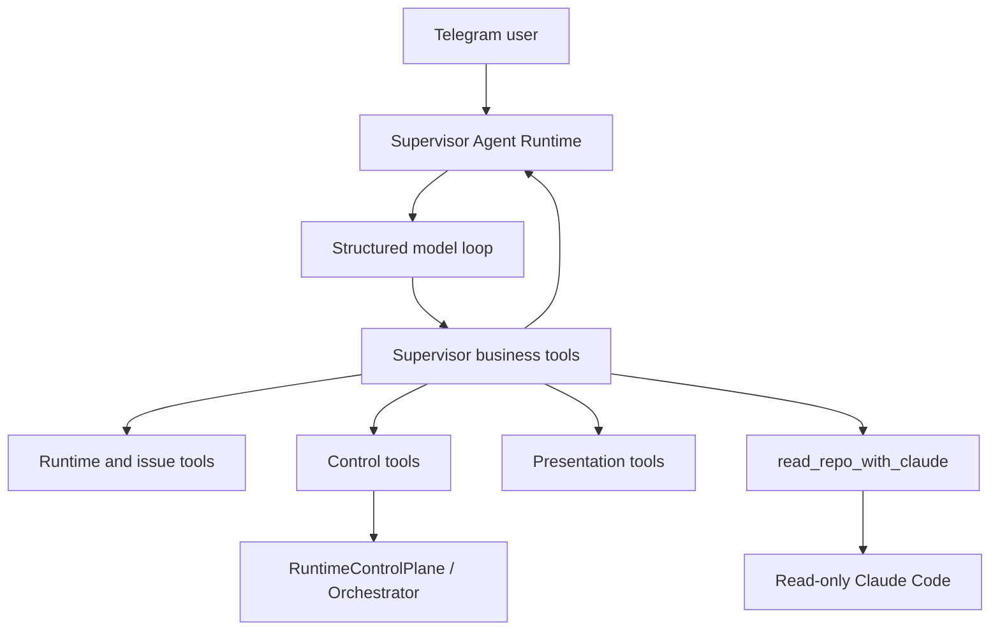

# Supervisor Agent Runtime Design

Date: 2026-05-08
Status: Design draft for user review
Scope: Telegram supervisor natural-language entrypoint, business tool runtime, repo-aware read-only Claude integration, issue/runtime control actions

## Summary

Telegram should feel like one capable supervisor assistant, not a collection of parsers and fallback brains. All Telegram natural-language messages enter a durable Supervisor Agent Runtime. The runtime runs an agent loop, calls structured business tools, emits progress updates for long work, and returns concise answers, issue cards, plan cards, or pending confirmations.

Slash commands, orchestrator actions, runtime issue APIs, tracker operations, and read-only Claude Code become backend tools. Users do not need to know those tools exist. Claude Code is not the coordinator. It is a read-only repository understanding backend exposed through a supervisor business tool.

## Goals

- Make Supervisor Agent Runtime the only intelligent Telegram natural-language entrypoint.
- Replace scattered regex and mixed fallback routing with a structured business tool loop.
- Let the supervisor read repositories, inspect issue/runtime state, diagnose failures, and propose next actions.
- Preserve safety: read actions run directly; selected low-risk writes can run directly at high confidence; high-risk writes default to confirmation.
- Preserve Telegram usability with short acknowledgement messages, progress summaries, final answers, and cards.
- Make supervisor runs durable so pending actions, progress, and tool history survive restarts and can be replayed.

## Non-Goals

- Do not remove explicit slash commands in v1. They remain available as deterministic expert shortcuts.
- Do not give Claude Code business-control powers such as closing issues, retrying runs, changing tracker state, or sending Telegram cards.
- Do not force every interaction through a long-running repo read. The supervisor should choose the right tool.
- Do not rebuild the orchestrator in this project. The runtime wraps existing orchestrator and RuntimeControlPlane capabilities as tools.

## Architecture



The runtime owns Telegram natural-language handling. It builds context, asks the model for structured turns, executes tools through a registry, records every step, and decides when to send progress, final answers, cards, or confirmation prompts.

The existing command service and runtime APIs remain useful, but they move behind tools. For example, `retry_issue` wraps `RuntimeControlPlane.retryIssue`, and `list_issues` wraps `RuntimeControlPlane.getOverview`.

## Tool Namespaces

Supervisor business tools and Claude Code tools are separate.

Supervisor business tools include:

- `list_issues`
- `get_issue`
- `diagnose_issue`
- `get_issue_history`
- `show_issue_card`
- `show_plan_card`
- `summarize_issue_list`
- `read_repo_with_claude`
- `clear_repo_conversation`
- `retry_issue`
- `stop_issue`
- `set_default_project`
- `create_issue`
- `close_issue`
- `supersede_issue`
- `override_governance`
- `rewrite_governance`
- `split_governance`

Read-only Claude Code tools are limited to repository understanding:

- `Read`
- `Glob`
- `Grep`
- `WebSearch` and `WebFetch` only when the user explicitly asks for external or latest information

Read-only Claude Code cannot use:

- `Write`
- `Edit`
- `Bash`
- Business tools such as `close_issue`, `retry_issue`, `create_issue`, or Telegram card tools

## Structured Turn Protocol

The supervisor model returns one structured turn at a time.

```ts
type SupervisorTurn =
  | {
      type: 'tool_call';
      tool: string;
      args: Record<string, unknown>;
      reason: string;
    }
  | {
      type: 'progress_update';
      message: string;
    }
  | {
      type: 'final_answer';
      message: string;
      cards?: CardSpec[];
    }
  | {
      type: 'clarify';
      question: string;
    }
  | {
      type: 'confirm_action';
      action: SupervisorToolCall;
      summary: string;
    };
```

The backend validates each turn. Invalid turns are rejected and fed back to the model with a short repair instruction. The runtime never executes arbitrary text as a command.

## Tool Definition Contract

Every tool is registered through a definition:

```ts
interface SupervisorToolDefinition {
  name: string;
  description: string;
  input_schema: JSONSchema;
  risk: 'read' | 'low_write' | 'high_write';
  direct_execution_policy: 'always' | 'high_confidence' | 'confirm_by_default';
  execute(args: unknown, context: SupervisorToolContext): Promise<SupervisorToolResult>;
}
```

Tool results should be structured and summarized. The model sees enough information to reason, but Telegram users should see concise conclusions instead of raw dumps.

## Agent Loop

Each Telegram message creates or resumes a `supervisor_run`.

1. Build context: conversation, default project, focused repo, focused issue, pending actions, recent messages, runtime overview, available tools.
2. Ask the model for a structured turn.
3. If the turn is a tool call, validate schema, evaluate policy, execute the tool, record the result, and continue.
4. If the turn is a progress update, send or throttle it according to Telegram rules and continue.
5. If the turn is a high-risk action, create a confirmation card unless the policy allows direct execution.
6. If the turn is a final answer or clarification, deliver it and complete the run.
7. If the user interrupts with "stop", "cancel", "give me the conclusion", or similar text, cancel or summarize the run.

The loop is not limited to a fixed number of steps. It is guarded by progress rules:

- The same `tool + args` cannot repeat when the previous result has not changed.
- Consecutive no-new-fact results force the model to summarize, clarify, or stop.
- Long work must emit progress at meaningful boundaries.
- A run can be cancelled, summarized early, or failed cleanly.

## Action Policy

Action policy is centralized in `SupervisorActionPolicy`.

Read tools always run directly:

- `list_issues`
- `get_issue`
- `diagnose_issue`
- `get_issue_history`
- `read_repo_with_claude`
- `list_repo_files`
- `show_issue_card`
- `show_plan_card`
- `summarize_issue_list`

Low-risk write tools can run directly at high confidence:

- `retry_issue`
- `stop_issue`
- `set_default_project`

High confidence requires:

- The target is unique.
- The current state allows the action.
- The user intent is explicit.
- The current user and transport are allowed to write.

High-risk write tools default to confirmation:

- `create_issue`
- `close_issue`
- `supersede_issue`
- `override_governance`
- `rewrite_governance`
- `split_governance`

If the user explicitly says "directly execute", "no confirmation", "close it now", or equivalent wording, the supervisor may skip confirmation, but the backend still validates target uniqueness, state, and permission. The final reply must say exactly what changed.

## Pending Actions

Pending actions belong to a supervisor run. A pending confirmation stores:

- Tool name
- Tool args
- Risk decision
- Reason
- Telegram message id
- Expiry
- Status

While a pending action exists:

- "confirm" executes it.
- "cancel" cancels it.
- Read-only questions can bypass it.
- A clearer new control request can replace it.
- Ordinary chat should mention that a pending action exists without making the assistant useless.

Completed, failed, or cancelled pending actions must never block later messages.

## Telegram Experience

The runtime uses a mixed progress model.

Short flows finish silently with only the final answer when they complete quickly.

Slow flows send a short acknowledgement, such as:

- "Got it. I am checking the current issues and run history."
- "I am reading the latest repository state and related runtime context."

Long flows send stage summaries every 8 to 12 seconds or at major tool boundaries:

- "I found the active issues. Now I am checking INT-158's failure history."
- "INT-158 looks like a tracker/orchestrator state mismatch. I am verifying both views."
- "The repository source is ready. I am asking read-only Claude Code to inspect the README and main files."

Final output is concise and user-facing:

- Conclusion
- Evidence summary
- Recommended next step
- Cards or confirmation buttons when useful

Card behavior:

- "Show me the card" sends the focused issue or plan card.
- "What issues exist?" sends a summary by default, not a card flood.
- "Show all cards" can send multiple cards with throttling.
- Edit failures fall back to sending a new message.

## Repository and Claude Code Memory

There are two memory layers.

Supervisor Runtime memory stores business-level context:

- User message
- Tool calls
- Tool summaries
- Progress messages
- Pending actions
- Final answer

Repo Claude memory stores code-level context:

- Keyed by `transport + conversation_id + repo_ref`
- Reused while the user talks about the same repo
- Switched when the user switches repo
- Cleared by `/clear` or "clear this repository memory"
- Allowed to rely on Claude Code's own compaction behavior

The `read_repo_with_claude` tool prepares source first:

- Resolve the configured route.
- If only `github_owner/github_repo` exists, prepare shared source cache.
- Fetch and prune.
- Fast-forward to the remote default branch.
- Never modify the user's local checkout.
- Read from `workspaces/<repo>/source`.

Issue-aware repo analysis works by first using business tools to fetch runtime issue context, then passing that structured context to read-only Claude Code. Claude Code can explain code and repo implications, but not operate the issue.

## Durable State

Add or consolidate durable state around supervisor runtime.

`supervisor_runs`:

- Run id
- Transport and conversation id
- User id
- State: `running`, `waiting_confirmation`, `completed`, `cancelled`, `failed`, `summarized_early`
- Repo ref
- Active issue id
- User message
- Final message
- Created and updated timestamps
- Last progress timestamp
- Step count

`supervisor_run_events`:

- User messages
- Model turns
- Tool call starts and completions
- Tool failures
- Progress messages
- Confirmation requests
- Confirmation acceptances and cancellations
- Final answers

`supervisor_tool_calls`:

- Tool name
- Args hash
- Result summary
- Risk
- Duration
- Status
- Idempotency key

`supervisor_pending_actions`:

- Run id
- Tool name
- Args
- Policy decision
- Telegram message id
- Status
- Expiry

`repo_claude_conversations`:

- Transport
- Conversation id
- Repo ref
- Backend session id
- Last used timestamp
- Status
- Clear generation

Startup recovery:

- Stale `running` runs become `failed` or `cancelled_by_restart`.
- `waiting_confirmation` runs remain actionable until expiry.
- Completed, cancelled, or failed runs do not block new messages.
- The user can ask what happened and receive a replay summary.

## Migration Plan

Phase 1: Runtime skeleton

- Add Supervisor Agent Runtime, tool registry, run repositories, event repositories, and action policy.
- Route all Telegram natural language to the runtime.
- Wrap existing `RuntimeControlPlane`, `BotCommandService`, and read-only advisor capabilities as tools.

Phase 2: Agent loop and progress

- Implement structured turn parsing.
- Implement tool execution loop.
- Record tool transcripts.
- Add progress throttling.
- Add duplicate-call and no-progress guards.
- Add cancellation and summarized-early behavior.

Phase 3: Confirmation and control

- Move pending confirmation into supervisor runs.
- Route callback confirm and cancel to the runtime.
- Apply unified action policy.
- Keep old `bot_pending_actions` only as compatibility until migrated.

Phase 4: Repo Claude and issue-aware diagnosis

- Make `read_repo_with_claude` prepare shared source cache first.
- Reuse repo Claude conversations per `conversation_id + repo_ref`.
- Inject runtime issue snapshots and histories for stuck issue diagnosis.
- Support repo memory clearing and repo switching.

## Compatibility

Explicit slash commands remain available:

- `/status`
- `/retry`
- `/close`
- `/project`
- `/clear`
- Other existing commands

Natural-language Telegram messages no longer route through the old parser-first path. The old services remain as tool executors until they can be retired safely.

Existing Plan Card and SupervisorSessionService behavior should be wrapped as presentation or planning tools instead of being a competing entrypoint.

## Testing

Focused tests:

- All Telegram natural-language messages enter Supervisor Agent Runtime.
- `hello` returns a chat reply without invoking repo or control tools.
- `what issues exist` calls `list_issues` and returns a concise summary.
- `how is INT-158 doing` calls `get_issue` and `diagnose_issue`.
- `show me the card` calls `show_issue_card`.
- `retry INT-158` directly retries only when state and confidence allow it.
- `stop INT-158` directly stops only when the issue is running.
- `set project to test2` directly updates default project when the route exists.
- `close INT-157` creates a confirmation by default.
- `directly close INT-157` executes directly after backend validation.
- `create an issue for README docs` creates a Plan Card or confirmation, not an immediate unapproved execution unless explicitly requested.
- Existing pending actions do not block read questions.
- Cancelled or completed pending actions never block later text.
- Long tool loops send progress updates and final results.
- Duplicate tool calls are prevented.
- Interrupted runs become `cancelled` or `summarized_early`.
- `read_repo_with_claude` uses shared source cache for routes without `local_path`.
- Claude Code remains read-only and cannot call business-control tools.

Live Telegram checks:

- `hello`
- `有哪些 issue`
- `158 怎么样了`
- `卡片给我`
- `重试 158`
- `吧 157 给我关了吧`
- `直接把 157 关了`
- `README 有啥`
- `这个仓库适合做什么 artifact`
- During long work: `先给结论`

Verification commands:

- Focused Bun tests for supervisor, bots, runtime, database repositories, and gateway callbacks.
- `bun run build`
- `git diff --check`
- Real Telegram Desktop or webhook live-path verification with manifest checks.

## Open Implementation Notes

- The model should receive a compact tool catalog, not the entire codebase.
- Tool result summaries must be deterministic and compact.
- Tool execution should use idempotency keys for write actions.
- Confirmation cards should include action, target, reason, expected effect, and buttons.
- Runtime should expose run diagnostics in the bot manifest or runtime API.
- Logging should separate Telegram ingress, supervisor run state, tool execution, and outbound delivery.
